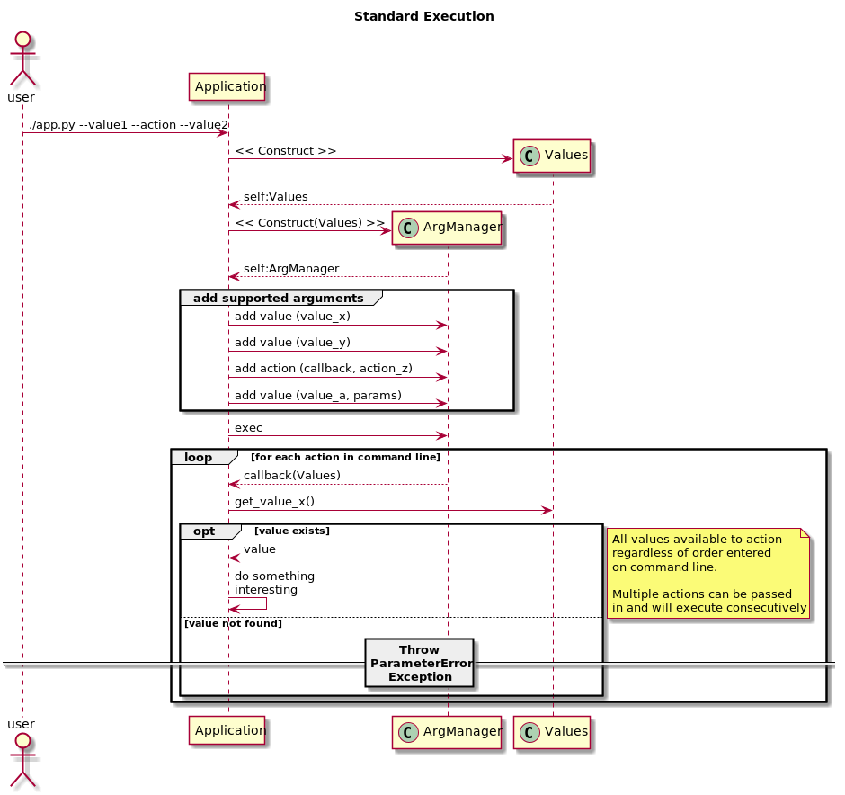

# argument_manager
(Command Line) argument manager using argparse

* Provides a simple mechenism to seperate actions from values
* Allows execution of multiple actions against the same value set




```
Example code coming soon.this is a very rough untested placeholder

  def callback_a(values):
    value = values.get_cb_value()

  def callback_b(values):
    value = values.get_cb_value()
    value2 = values.get_another_value()


    argManager = args.ArgsManagerFactory().getManager() \
        .add_action(callback_a, '--exec-callback', help="execute a function called callback a", action='store_true') \
        .add_value('--cb-value', metavar='a value for exec-callback', nargs=1, default=[10])\
        .add_value('--another-value', metavar='a value used in callback2', nargs=1, default=[10])\
        .add_action(callback_b, '--callback2', help="execute a function called callback2", action='store_true') 
try:        
    argManager.exec()
except ParameterError as e:
    print("Input Parameter Error while executing the {} command: ".format(argManager.getCurrentAction()), e)
    argManager.print_help()
    exit(1)


```
$> python3 ./your-appname --exec-callback --cb-value 10 --another-value asd --callback2
